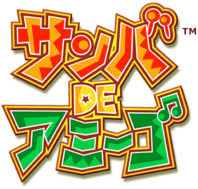

## Samba de Amigo Ver. 2000: modding tools and information.

[Samba de Amigo](https://en.wikipedia.org/wiki/Samba_de_amigo) is a rhythm game developed by Sonic Team and published by Sega. There are versions for arcade machines, Dreamcast and Wii consoles.

[Samba de Amigo: Ver. 2000](https://en.wikipedia.org/wiki/Samba_de_amigo#Ver._2000) was released for the Dreamcast only in Japan, including 20 new songs and new playing modes.

Here you'll find information and tools to help you mod "Samba de Amigo: Ver. 2000" for the Dreamcast, such as adding English translations and custom songs. This can put your old maracas to good use again! :)

#### What's available
 - [description of all files in the Samba de Amigo ver. 2000 GDI image](docs/list%20of%20Sda2K%20files.txt) (including Japanese to English translations).
 
 #### To-do
 - [ ] create GUI Python script to simplify GDI modding.
